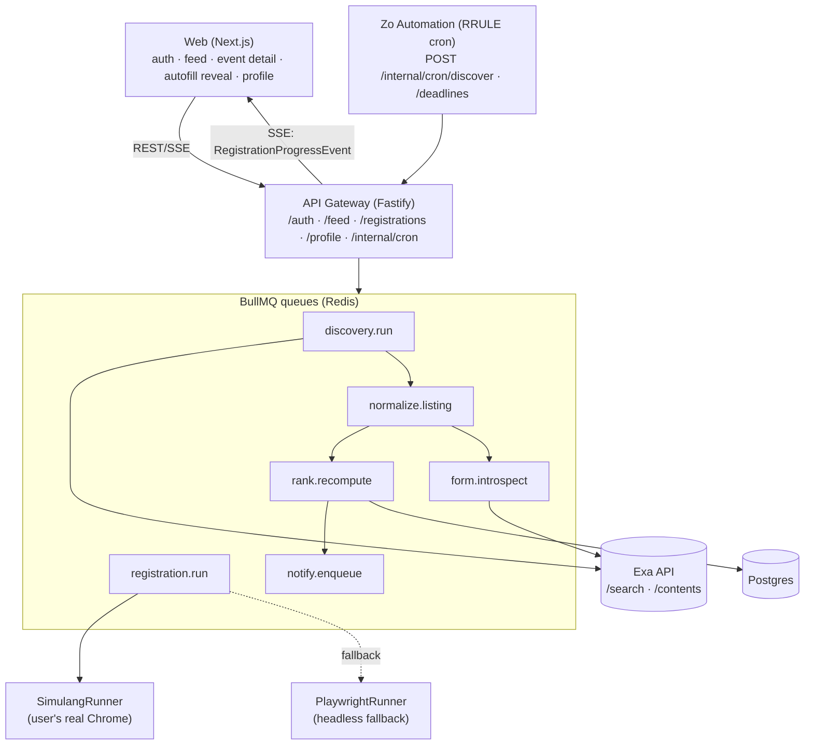

# EarlyBirds

> AI agent that discovers hackathons and auto-fills registration forms — with a mandatory human confirm gate.
> _"Find hackathons. Register once. Move on."_

EarlyBirds runs a continuous pipeline: it **discovers** hackathons via [Exa](https://exa.ai) neural
search, **normalizes + dedups** them into canonical events, **ranks** them against a user profile,
and — on a single click — **auto-fills the registration form in the user's real browser** and streams
the agent's progress live. Nothing is ever submitted until the human approves the filled form.

The system is **contract-first**: every service talks through typed interfaces + zod schemas in
`@earlybirds/contracts`, so the frontend, gateway, and workers can be built and tested in isolation.

- **Design spec (source of truth):** [`DESIGN.md`](DESIGN.md)
- **Clickable prototype:** [`prototype/index.html`](prototype/index.html) — open in a browser, no build
- **Prototype delta prompt:** [`MOCK_PROMPT.md`](MOCK_PROMPT.md)

---

## Repository layout

npm-workspaces monorepo. TypeScript + ESM everywhere.

```
packages/
  contracts/   @earlybirds/contracts — typed domain model, zod schemas, BullMQ queue/payload defs
  db/          @earlybirds/db        — Prisma schema + singleton Postgres client
services/
  gateway/     @earlybirds/gateway   — Fastify BFF: REST + SSE + auth, enqueues jobs (port 3001)
  worker/      @earlybirds/worker    — BullMQ workers + registration runners (Simulang / Playwright)
  web/         @earlybirds/web       — Next.js 15 + React 19 + Tailwind frontend (port 3000)
scripts/       seed + Simulang probe / dry-run helpers
fixtures/      cached Exa response + recorded Google Form DOM for offline dev
prototype/     standalone single-file HTML prototype (no build)
```

## Architecture

Services never touch each other's tables. They integrate through **two seams only**: typed BullMQ
jobs and typed HTTP endpoints on the gateway.



**Registration is the crown jewel** — an explicit state machine
(`queued → introspecting → filling → awaiting_approval → submitting → succeeded`) with live SSE
progress and a hard human-approval stop before submit.

## Tech stack

| Layer | Choice |
|---|---|
| Language | TypeScript (ESM), Node ≥ 22.18 |
| Discovery | **Exa** `/search` (deep + `outputSchema`) + `/contents` |
| Frontend | Next.js 15, React 19, Tailwind (Hanken Grotesk / IBM Plex Mono) |
| API | Fastify 5 + zod, SSE for live run progress, bcrypt auth |
| Queue | BullMQ on Redis |
| DB | Postgres + Prisma |
| Registration | **Simulang** (`@simular-ai/simulang-js`, drives the user's real Chrome) + Playwright (headless fallback) |
| Reasoning | OpenAI (ranking reasons, form-field inference) — optional |
| Local infra | docker-compose: Postgres 16, Redis 7, MinIO (S3) |

Sponsor roles per [`DESIGN.md` §2.5](DESIGN.md): **Exa** is the discovery engine, **Zo Computer**
is the always-on host + scheduler, **Simulang** drives the local visible-browser registration,
**OpenAI/Codex** is the reasoning layer, and **Cursor** powers the parallel contract-first build.

---

## Quick start

### Prerequisites

- Node ≥ 22.18 and npm
- Docker (for Postgres / Redis / MinIO) — only needed for the full backend
- A `.env` at the repo root with at least `DATABASE_URL` and `REDIS_URL`. Sponsor keys
  (`EXA_API_KEY`, `OPENAI_API_KEY`) are **optional** — discovery falls back to
  [`fixtures/exa-response.json`](fixtures) and ranking/field-inference degrade gracefully without
  them. **Never commit `.env`.**

```bash
npm install
```

### Option A — Frontend only (fastest)

The web app ships with mock data on by default (`NEXT_PUBLIC_USE_MOCKS=1`), so you can click through
the entire flow — onboarding, feed, event detail, the autofill reveal, and all 8 registration states
— with no backend running.

```bash
npm run dev:web        # http://localhost:3000
```

### Option B — Full stack

Run each in its own terminal from the repo root:

```bash
npm run infra:up         # Postgres + Redis + MinIO via docker compose
cp .env.example .env      # fill in API keys if you have them (optional)
npm run db:push           # apply the Prisma schema + generate the client
npm run db:seed           # demo user "demo-user" + 2 hackathons + ranked events

npm run dev:gateway       # API on :3001
npm run dev:worker        # queue workers
npm run dev:web           # frontend on :3000
```

Then open <http://localhost:3000>. Stop infra with `npm run infra:down`.

### Mock vs. real backend

The frontend defaults to **mock data** so it runs with no backend. To hit the real gateway, create
`services/web/.env.local`:

```
NEXT_PUBLIC_USE_MOCKS=0
NEXT_PUBLIC_GATEWAY_URL=http://localhost:3001
```

With mocks off:
- **Sign up / sign in** on `/welcome` calls `POST /auth/{signup,login}` and stores the `userId` in
  `localStorage` (`earlybirds.session`). All API calls thread that id.
- **Onboarding** (`/onboarding/basics`, `/onboarding/voice`) saves to `PUT /profile`.
- **Discover / event detail** read `GET /feed?userId=` and `GET /events/:id`.
- **Registrations** reads `GET /registrations?userId=`.
- **Auto-register** (`/register/[eventId]`) creates a run (`POST /registrations`), streams progress
  over SSE (`GET /registrations/:id/stream`), persists confirm-gate edits
  (`PUT /registrations/:id/plan`), then approves (`POST /registrations/:id/approve`).

Leave `NEXT_PUBLIC_USE_MOCKS` unset (or `1`) to demo the UI with seeded mock data and the `?step=`
DEMO STATES picker on the register screen.

### Registration runners

The worker uses **SimulangRunner** (macOS accessibility-tree automation that drives the user's real
Chrome — their session, their cookies). Probe a form's a11y tree or dry-run the runner without
submitting:

```bash
simulang run scripts/probe-form.ts <url>                                    # inspect fields/buttons
cd services/worker && npx tsx ../../scripts/test-simulang-runner.ts <url>   # introspect + fill, no submit
```

**PlaywrightRunner** remains available as the headless fallback (e.g. Google Forms).

---

## Environment variables

Copy [`.env.example`](.env.example) to `.env`. In production these are stored as Zo Secrets.

| Var | Required | Purpose |
|---|---|---|
| `EXA_API_KEY` | optional | Live Exa discovery + form-text extraction. Falls back to fixtures if unset. |
| `OPENAI_API_KEY` | optional | LLM ranking reasons + form-field inference. Degrades to deterministic output if unset. |
| `OPENROUTER_API_KEY` | optional | Simulang VLM grounding fallback. |
| `DATABASE_URL` | yes (backend) | Postgres connection (default matches docker-compose). |
| `REDIS_URL` | yes (backend) | Redis / BullMQ connection. |
| `S3_*` | optional | MinIO/S3 for screenshots + raw payloads. |
| `PORT` | optional | Gateway port (default `3001`). |
| `CRON_SECRET` | yes (prod) | Shared secret for `X-Cron-Secret` on `/internal/cron/*`. |

Web-only (set in `services/web/.env.local`): `NEXT_PUBLIC_USE_MOCKS` (`1` = mocks, `0` = live
gateway), `NEXT_PUBLIC_GATEWAY_URL` (default `http://localhost:3001`), `NEXT_PUBLIC_DEMO_USER_ID`.

## Scripts

Run from the repo root:

| Script | What it does |
|---|---|
| `npm run typecheck` | Type-check the whole monorepo |
| `npm run infra:up` / `infra:down` | Start / stop Postgres + Redis + MinIO |
| `npm run db:push` | Apply the Prisma schema + generate the client |
| `npm run db:seed` | Seed the demo dataset (idempotent upserts) |
| `npm run db:studio` | Open Prisma Studio |
| `npm run dev:gateway` | Run the Fastify gateway with hot reload |
| `npm run dev:worker` | Run the BullMQ workers with hot reload |
| `npm run dev:web` | Run the Next.js frontend |

## How discovery works (offline-friendly)

1. A `discovery.run` job calls the **ExaAdapter**, which issues a `deep` search with an `outputSchema`
   so Exa returns structured hackathon records (with grounding citations) directly. With no
   `EXA_API_KEY`, it reads [`fixtures/exa-response.json`](fixtures/exa-response.json) instead.
2. Each result is enqueued as a `normalize.listing` job → dates/themes/location normalized, duplicates
   merged by title-similarity + date window, and the canonical `Hackathon` is upserted.
3. New/changed events trigger `rank.recompute` (theme overlap + deadline + location, plus optional
   LLM reasons) and `form.introspect` (Exa `/contents` → LLM → `FormFieldSpec[]`).
4. High-scoring matches write rows to `notify.enqueue`; delivery is handed to Zo (see status below).

## Project status

**Implemented:** Exa discovery (with fixture fallback) · normalize + dedup · ranking · form
introspection · the full registration state machine with live SSE · **SimulangRunner** (drives the
user's real Chrome) + Playwright headless fallback · email/password auth (bcrypt) · `db:seed` demo
data · real-backend web integration · cron endpoints.

**Planned / deferred** (specced in `DESIGN.md`, not yet built):

- **Notify delivery** — the notify worker writes `pending_notifications` rows; actual Telegram/SMS
  delivery via Zo is deferred (post-M2).
- **DevpostAdapter** (direct JSON) and **trip planning** — deferred per `DESIGN.md` §5.6 / §13.

---

_The types in [`@earlybirds/contracts`](packages/contracts/src) are the contract. When code and prose
disagree, the contract wins. See [`DESIGN.md`](DESIGN.md) for the full technical design._
